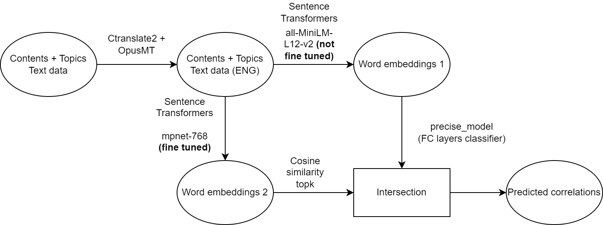
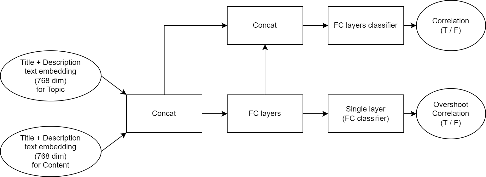

# KaggleLearningEquality2023
Repo for project for Kaggle Learning Equality 2023 Competition.
 * https://www.kaggle.com/competitions/learning-equality-curriculum-recommendations
 
Mainly used Tensorflow Keras for training custom models.

# Files
 * Translation
   * translate_helpers.py
 * Models
   * model_bert_fix_stepup.py (Model definition)
   * model_bert_pipeline.py (Training)
 * Data + train/test split
   * data/ folder
     * bert_tokens/ - Folder for storing word embeddings computed with original BERT model
     * sbert_vectors/mininet_L12_english384 - Word embeddings computed with non-finetuned Sentence Transformers BERT model
     * Not uploaded -- too large for GitHub.
   * data_bert.py - Basic script for obtaining train/test split. 
     * train_contents_num_id - Contents in training set
     * train_topics_num_id - Topics in training set
     * test_contents_num_id - Contents in test set
     * test_topics_num_id - Topics in test set
     * Guaranteed that train contents can only belong to train topics, and same for test contents and topics.
   * data_bert_tree_struct.py - Using the train/test split obtained in data_bert.py, and some attributes belonging to the tree structure of data, obtain correlations w.r.t. training data and test data.
 * tree_structure_visualization.py - Script for interactive GUI for visualizing the tree structure of the data (written with TkInter). 
 * Evaluation of model trained on train set, by computing F2 score on test set
   * test_set_score.ipynb
   * Contains many models
   * Best F2 score $\sim 0.25$, precise_best_trained_on_train_eval_test under "Generate combined overshoot data"

# Model pipeline

 * Sentence transformers: https://www.sbert.net/
 * ctranslate2: https://github.com/OpenNMT/CTranslate2
 * OpusMT translation models: https://github.com/Helsinki-NLP/Opus-MT

# model_bert_fix_stepup (precise model)

 * Overshoot correlation means that, for a $(\text{topic}, \text{content}) \in \text{Topic} \times \text{Content}$ tuple, there is a $\text{topic}'$ close to $\text{topic}$ in the topic tree such that $(\text{topic}', \text{content})$ are correlated. This "relaxes" the correlation condition.
 * The overshoot correlation is used only in training, not in inference.
